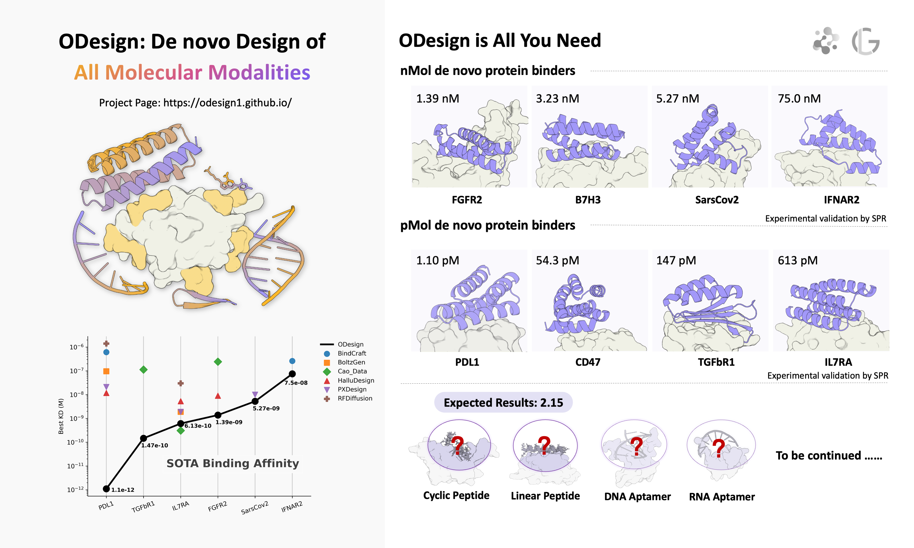

<div align="center">
  
</div>

<div align="center">

[](https://odesign.lglab.ac.cn/)
[](https://odesign1.github.io/static/pdfs/technical_report.pdf)
[](https://odesign1.github.io/)
[](https://chat.whatsapp.com/BfO6E7EGYpwDdjAAreKDVq?mode=wwt)
[](https://github.com/The-Institute-for-AI-Molecular-Design/ODesign/blob/main/imgs/odesign_wechat_qr_code.jpg)
</div>


# ODesign-pipeline

🎉 Here we present **ODesign-pipeline**, a unified design pipeline for proteins, nucleic acids, and small molecules. It couples **ODesign** with a filtering stack based on **AlphaFold3 ReFold** and **PyRosetta Score**.

🎉 In our wet-lab validation, we performed one round of mini-protein design across eight targets; four reached **picomolar affinity**.

🛠️ Peptide- and aptamer-design pipelines are under development.

<div align="center">
  
</div>


# Table of contents
- [Installation](#installation)

- [Usage](#usage)
    - [Sampling](#sampling)
    - [Filter](#filter)
      - [AF3 ReFold](#af3-refold)
      - [Score](#score)

# Installation

**Step 1 — Init Main Repo**
```bash
git clone https://github.com/The-Institute-for-AI-Molecular-Design/ODesign-pipeline.git
cd ODesign-pipeline
```

**Step 2 — Prepare Sampling Module (ODesign)**

```bash
git clone https://github.com/The-Institute-for-AI-Molecular-Design/ODesign.git
```
1. create environment
```bash
conda create -n odesign python=3.10
conda activate odesign
pip install -r ./ODesign/requirements.txt -f https://data.pyg.org/whl/torch-2.3.1+cu121.html
```

2. get required inference data

- get checkpoints

```bash
bash ./ODesign/ckpt/get_odesign_ckpt.sh ./ODesign/ckpt
```

- get required inference data

Before running inference for the first time, please download the `components.v20240608.cif` and `components.v20240608.cif.rdkit_mol.pkl` from [Google Drive](https://drive.google.com/drive/folders/1wPmwIrC3G52q1JFY0RXY95tjKDl7YEln?usp=drive_link), and place these files under `./ODesign/data`.

**Step 3 — Prepare Filter Module (AlphaFold3 X PyRosetta)**

- AlphaFold3

please refer to [AlphaFold3 Installation Guide](https://github.com/google-deepmind/alphafold3/blob/main/docs/installation.md) for more details.

- PyRosetta
```bash
pip install pyrosetta-installer
python -c 'import pyrosetta_installer; pyrosetta_installer.install_pyrosetta()'
```

please refer to [PyRosetta Docs](https://www.pyrosetta.org/documentation) for more details.

**Repo Layout**

This pipeline assumes the following directory structure (relative to this repo root):

```
ODesign-pipeline/
├── examples/
├── filter/
├── ODesign/
│   ├── ckpt/
│   ├── data/
├── scripts/
├── utils/
└── README.md
```

# Usage

## Sampling

After installation, launch the ODesign sampling process using:

```bash
bash ./scripts/run_odesign.sh \
  --infer_model_name odesign_base_prot_flex \
  --data_root_dir ./ODesign/data \
  --ckpt_root_dir ./ODesign/ckpt \
  --input_json_path ./examples/prot_binder/prot_binder.json \
  --exp_name prot_binder \
  --seeds "[42, 123]" \
  --N_sample 20 \
  --invfold_topk 8 \
  --output_dir ./examples/prot_binder/odesign_out \
  --gpus 0
```

In practical applications, we ran large-scale inference (over 10k designs). Increasing the number of seeds significantly improves the diversity and validity of generated designs. Therefore, we recommend keeping `N_sample` fixed at 20 and increasing the number of `seeds` to scale up the total sampling budget.


| Argument              | Description                                                                                                                                             | Example                             |
| ---------------------- | ------------------------------------------------------------------------------------------------------------------------------------------------------- | ----------------------------------- |
| `infer_model_name`     | Model used for inference. | `odesign_base_prot_flex`            |
| `data_root_dir`        | Directory where downloaded data is stored.                                                                                                            | `./ODesign/data`                            |
| `ckpt_root_dir`        | Directory where model checkpoints are stored.                                                                                                           | `./ODesign/ckpt`                            |
| `input_json_path`      | Path to the input design specification JSON file.                                                                                                       | `./examples/prot_binder/prot_binder.json` |
| `exp_name`                  | Custom label for inference output directory.                                                           | `prot_binder`    |
| `seeds`                | Random seeds used during generation. Supports multiple seeds.                                                                              | `[42]` or `[42, 123]`               |
| `N_sample`             | Number of generated samples per seed.                                                                                                            | `20`                                 |
| `invfold_topk` |  Number inverse folding per backbone.                                                                                                                                | `8`                                 |
| `output_dir` | ODesign inference output directory.                                                                                                                                | `./examples/prot_binder/odesign_out`                                 |
| `gpus` | GPU device for inference.                                                                                                                                | `0` or `0,1,2,3`                                 |


## Filter

We built the filtering module of the ODesign pipeline based on AF3 and PyRosetta, integrating deep-learning and physics-based modeling perspectives. The main workflow consists of AF3 ReFold and scoring using AF3 confidence metrics and PyRosetta scores.

### AF3 ReFold


We provide a simple guideline for running AlphaFold3 on large-scale scoring tasks.

1. Pre-search

- run alphafold3 for target only and get results like:
```
target_seq/
├── seed-1_sample-0/
├── target_confidences.json
├── target_data.json
├── target_model.cif
├── target_summary_confidences.json
├── ranking_scores.csv
└── TERMS_OF_USE.md
```

- Extract Target templates and MSAs

A script is provided to extract MSAs and templates from `*_data.json` under af3 outputs, and use it as below:

```bash
python ./utils/af3_utils.py \
  --root  ./target_seq  \
  --presearch_outdir ./msa_templates
```
please set `--root` to your `target_seq/` directory.

Outputs Files: 

```
msa_templates/
├── index.json
├── msa.json
├── target_seq_A_0.cif
├── target_seq_A_1.cif
├── target_seq_A_2.cif
├── target_seq_A_3.cif
├── target_seq_A_paired_msa.a3m
├── target_seq_A_unpaired_msa.a3m
└── template_queries.json
```

`index.json` File Format under `msa_templates/`:

```
{
  "target_seq": {
    "unpairedMsaPath": "target_seq_A_unpaired_msa.a3m",
    "pairedMsaPath": "target_seq_A_paired_msa.a3m",
    "templates": [
      {
        "mmcifPath": "target_seq_A_0.cif",
        "queryIndices": [0,1,2, ...]
      },
      ...
    ]
  }
}
```

2. Inference

- Prepare the input JSON

  - Since AF3 and PyRosetta score are related to chain ids, Please set the binder as chain A and the target as chain B.
  - Add `unpairedMsaPath`, `pairedMsaPath`, and `templates` (for the **target chain**) from `index.json` into your AF3 input JSON.
  - Keep the **binder chain** MSA/templates empty (binder is designed de novo).
  - Mount the `msa_templates/` absolute path into the Docker container.

- Run Large-Scale AlphaFold3 Inference

Once you have pre-searched the MSA and templates and added them to the input JSON file, you can set the `run_alphafold.py` parameters as follows:

```bash
docker run -it \
    --volume $HOME/af_input:/root/af_input \
    --volume $HOME/af_output:/root/af_output \
    --volume <MODEL_PARAMETERS_DIR>:/root/models \
    --volume <DATABASES_DIR>:/root/public_databases \
    --volume <msa_templates_dir>:<msa_templates_dir>  \
    --gpus all \
    alphafold3 \
    python run_alphafold.py \
    --json_path=/root/af_input/fold_input.json \
    --model_dir=/root/models \
    --output_dir=/root/af_output  \
    --run_data_pipeline False \
    --num_diffusion_samples 1
```
*this command is adapted from [AlphaFold3 official repo](https://github.com/google-deepmind/alphafold3/tree/main)*


Please organize your AF3 outputs using the following layout::

```
af3_out/
├── prot_binder_seq0/
│   ├── seed-1_sample-0/
│   ├── prot_binder_seq0_confidences.json
│   ├── prot_binder_seq0_data.json
│   ├── prot_binder_seq0_model.cif
│   ├── prot_binder_seq0_summary_confidences.json
│   ├── ranking_scores.csv
│   └── TERMS_OF_USE.md
├── prot_binder_seq1/
└── .../
```

### Score

- Score Metrics

For mini-protein, we present score metrics as below:

| Score Model      | Metric                      | Threshold (Pass Condition) |
| ---------------- | --------------------------- | -------------------------- |
| `AlphaFold3`     | `binder_ptm`                | `>= 0.8`                   |
| `AlphaFold3`     | `ipae_min`                  | `<= 1.5`                   |
| `PyRosetta`      | `ddg`                       | `<= -44`                   |
| `PyRosetta`      | `sap_score`                 | `<= 40`                    |
| `PyRosetta`      | `contact_molecular_surface` | `>= 400`                   |

> Note: Thresholds are **example settings used in ODesign miniprotein campaign** and should be tuned per target/protocol.

- Launch Command

```bash
cd ODesign-pipeline
conda activate odesign
bash ./scripts/run_filter.sh \
  --exp_name pdl1_prot_binder \
  --af3_out ./examples/prot_binder/af3_out \
  --filter_outdir ./examples/prot_binder/filter_out \
  --filter_json ./filter/score_json/miniprotein_filter.json \
  --binder_chain A  \
  --target_chain B  \
  --rosetta_xml ./filter/rosetta_cmds/ppi.xml
```

*please change `--af3_out` to your personal dir*

| Argument          | Description                                                                          | Example                                       |
| ----------------- | ------------------------------------------------------------------------------------ | --------------------------------------------- |
| `exp_name`      | Experiment name tag used to label outputs.         | `pdl1_prot_binder`                            |
| `af3_out`       | AF3 refold results directory to be filtered.                                          | `./examples/prot_binder/af3_out`              |
| `filter_outdir` | Output directory for filter results.                                                  |    `./examples/prot_binder/filter_out`           |
| `filter_json`   | Path to the filtering config JSON (score index, thresholds).                   | `./filter/score_json/miniprotein_filter.json` |
| `binder_chain`  | Chain ID for the binder in the complex.             | `A`                                           |
| `target_chain`  | Chain ID for the target in the complex.             | `B`                                           |
| `rosetta_xml`   | RosettaScripts XML used for scoring protocol.                              | `./filter/rosetta_cmds/ppi.xml`               |

- Understand the Outputs

**File Architecture**

```
filter_outdir/
├── af3_filter/
│   ├── exp_name_af3_filtered/
│   ├── exp_name_af3_pass.csv
│   └── exp_name_af3_fail.csv
├── rosetta_filter/
│   ├── exp_name_rosetta_filtered/
│   ├── exp_name_rosetta_pass.csv
│   └── exp_name_rosetta_fail.csv
└── exp_name_filter_final.csv
```

`exp_name_filter_final.csv`: Final CSV merging AF3 and Rosetta results.  
`exp_name_rosetta_filtered/`: Structure files (PDB) for designs that passed both AF3 and Rosetta filter.  
`*_fail.csv`: Failed designs and the corresponding failure reasons.  
`*_pass.csv`: Designs that passed the filter.  
`*_filtered/`: Structure files for designs that passed the filter.  


**Info - `exp_name_filter_final.csv`**

| Type          | Columns                                                                          | 
| ----------------- | ------------------------------------------------------------------------------------ | 
| Basic Info      | `sample_id`,`binder_seq`,`target_seq`,`pdb_dir`,`summary_json`         |
| AF3 Confidences      | `iptm`,`binder_ptm`,`complex_ptm`,`chain_ptm_avg`,`ipae_min`,`ipae_avg`         |
| Rosetta Scores      | `ddg`,`sap_score`,`contact_molecular_surface`         |

Designs are automatically ranked by `ddg` in `exp_name_filter_final.csv`, following the ODesign protein binder protocol.

# License

- **ODesign-pipeline (this repository) source code** is released under the **Apache License 2.0** (see `LICENSE`).
- **This repository does NOT distribute** any third-party model weights, databases, or proprietary software (including but not limited to AlphaFold3 parameters and PyRosetta distributions).
- To run the pipeline, users must obtain and install required third-party components **from their official sources** and comply with their respective licenses/terms.

